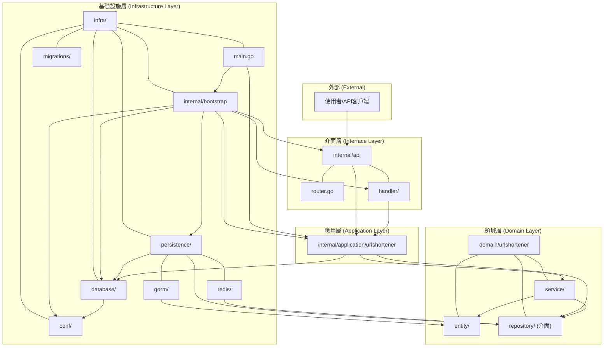

```mermaid
graph TD
    subgraph "外部 (External)"
        User[使用者/API客戶端]
    end

    subgraph "介面層 (Interface Layer)"
        API[internal/api]
        Router[router.go]
        Handler[handler/]
        API --- Router
        API --- Handler
    end

    subgraph "應用層 (Application Layer)"
        App[internal/application/urlshortener]
    end

    subgraph "領域層 (Domain Layer)"
        Domain[domain/urlshortener]
        Entity[entity/]
        DomainService[service/]
        RepoInterface["repository/ (介面)"]
        Domain --- Entity
        Domain --- DomainService
        Domain --- RepoInterface
    end

    subgraph "基礎設施層 (Infrastructure Layer)"
        Infra[infra/]
        DBInit[database/]
        Persistence[persistence/]
        GormImpl[gorm/]
        RedisImpl[redis/]
        Bootstrap[internal/bootstrap]
        Main[main.go]
        Config[conf/]
        Migrations[migrations/]
        Infra --- DBInit
        Infra --- Persistence
        Persistence --- GormImpl
        Persistence --- RedisImpl
        Infra --- Config
        Infra --- Migrations
        Infra --- Bootstrap
        Infra --- Main
    end

    User --> API
    API --> App
    Handler --> App
    App --> DomainService
    App --> RepoInterface
    DomainService --> Entity
    DomainService --> RepoInterface

    Bootstrap --> Config
    Bootstrap --> DBInit
    Bootstrap --> App
    Bootstrap --> Handler
    Bootstrap --> API
    Bootstrap --> Persistence

    Main --> Bootstrap
    Main --> App

    Persistence --> RepoInterface
    GormImpl --> Entity
    RedisImpl --> RepoInterface

    DBInit --> Config
    Persistence --> DBInit
    App --> DBInit
``` 